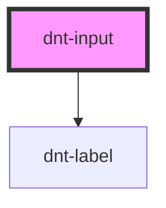

# d-input

<!-- Auto Generated Below -->

## Properties

| Property             | Attribute     | Description | Type      | Default     |
| -------------------- | ------------- | ----------- | --------- | ----------- |
| `error`              | `error`       |             | `string`  | `''`        |
| `id` _(required)_    | `id`          |             | `string`  | `undefined` |
| `label` _(required)_ | `label`       |             | `string`  | `undefined` |
| `placeholder`        | `placeholder` |             | `string`  | `''`        |
| `required`           | `required`    |             | `boolean` | `false`     |
| `type`               | `type`        |             | `string`  | `'text'`    |
| `value`              | `value`       |             | `string`  | `''`        |

## Events

| Event     | Description | Type               |
| --------- | ----------- | ------------------ |
| `dChange` |             | `CustomEvent<any>` |
| `dInput`  |             | `CustomEvent<any>` |

## Dependencies

### Depends on

- [dnt-label](../label)

### Graph

----------------------------------------------

*Built with [StencilJS](https://stenciljs.com/)*
