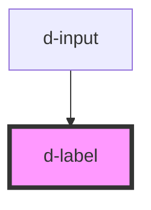

# d-label

<!-- Auto Generated Below -->

## Properties

| Property              | Attribute  | Description | Type      | Default     |
| --------------------- | ---------- | ----------- | --------- | ----------- |
| `htmlId` _(required)_ | `html-id`  |             | `string`  | `undefined` |
| `required`            | `required` |             | `boolean` | `undefined` |

## Dependencies

### Used by

 - [d-input](../input)

### Graph

----------------------------------------------

*Built with [StencilJS](https://stenciljs.com/)*
